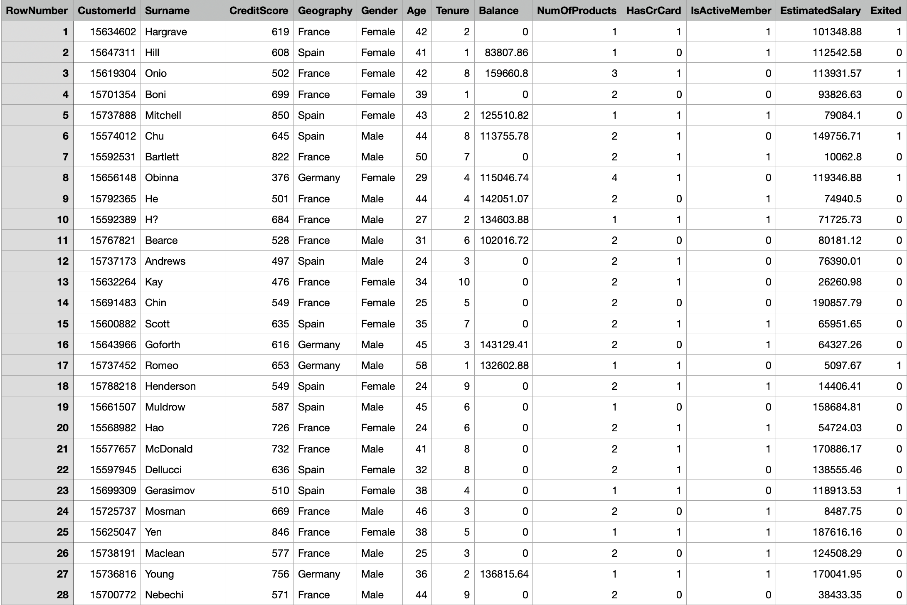
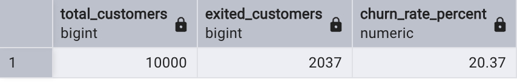
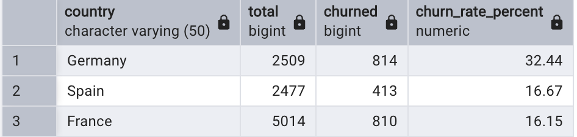
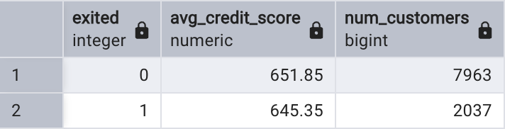
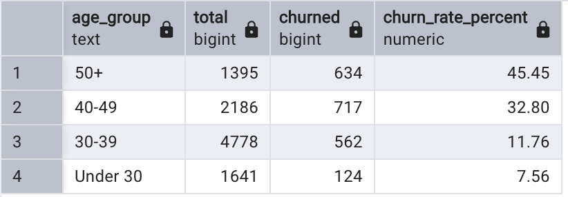
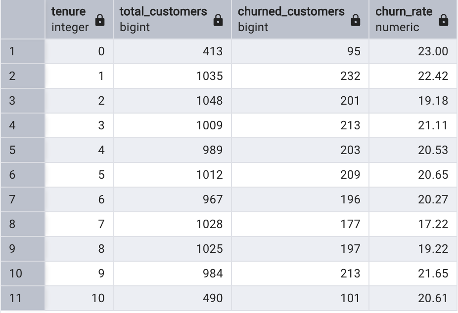
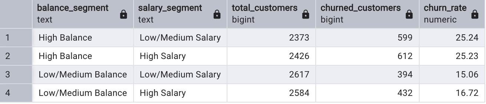
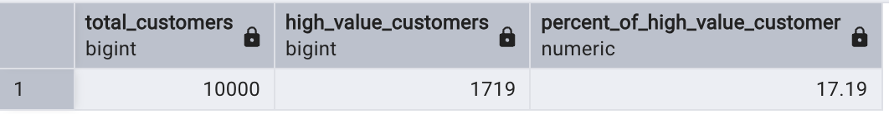

# Customer Churn Analysis - Project Overview
## The main goal of this project is to conduct an Exploratory Data Analysis (EDA) to analyze customer behavior, uncover key performance trends, and generate insights that can influence business decisions. Specifically, the analysis aims to identify the factors contributing to customer churn and provide actionable insights to reduce churn and enhance customer engagement strategies.
 

**This project simulates the role of a Data Analyst at a retail banking company, operating in the financial services sector. The company has been active since 2010, offering a variety of retail banking products such as savings accounts, credit cards, and personal financial services. The company's business model is designed around customer acquisition and retention, with a strong focus on reducing churn and improving customer lifetime value.**

## Dataset Structure
#### The dataset contains the following key attributes:
- **CustomerID:** Unique identifier for each customer.
- **Age:** Age of the customer.
- **Tenure:** Number of years the customer has been with the bank.
- **Balance:** The account balance of the customer.
- **EstimatedSalary:** The estimated salary of the customer.
- **NumOfProducts:** Number of products held by the customer.
- **HasCrCard:** Whether the customer has a credit card with the bank.
- **Exited:** Whether the customer has churned (1) or is retained (0).

#### Snapshot of Dataset

## Insights Summary
#### In order to evaluate campaign performance, we focused on the following key metrics:
- **Churn Rate:** Calculate churn rate by customer demographics and attributes.
- **Customer Lifetime Value:** Estimate the value of retained customers based on their balance and tenure.
- **Churn by Tenure:** Analyze churn across different customer tenures to identify trends.
- **High-Value Customer Segmentation:** Segment customers based on balance, salary, and number of products.

## Key Insights 
- The churn rate is 20.37%, meaning 1 in every 5 customers is leaving. This is a major business concern for long-term revenue stability.

  
- Germany has the highest churn rate (32.44%), nearly double that of France and Spain.
- France, despite having the largest customer base, has the lowest churn rate, pointing to effective retention strategies or higher satisfaction.

  
- Churned customers have a lower average credit score (645) than retained ones (651), suggesting a mild link between creditworthiness and loyalty.

  
- Churn increases with number of products:
    - 2 products → 21% churn
    - 4 products → 100% churn 

  
- Older customers are more likely to churn. This trend suggests a need for age-specific engagement programs or service redesign.

  
- Customers with both low and high tenure churn at similar rates, indicating tenure alone does not guarantee loyalty.

  
- Customers with higher balance and salary tend to churn more, possibly due to unmet expectations. This highlights a need to prioritize high-income customer retention.

  
- 17% of customers are high-value (defined as high balance and long tenure).
- Losing these customers can significantly impact revenue.

  
- Most customers who churned had an average tenure of 5 years, indicating mid-term customers are especially vulnerable to churn.

  

